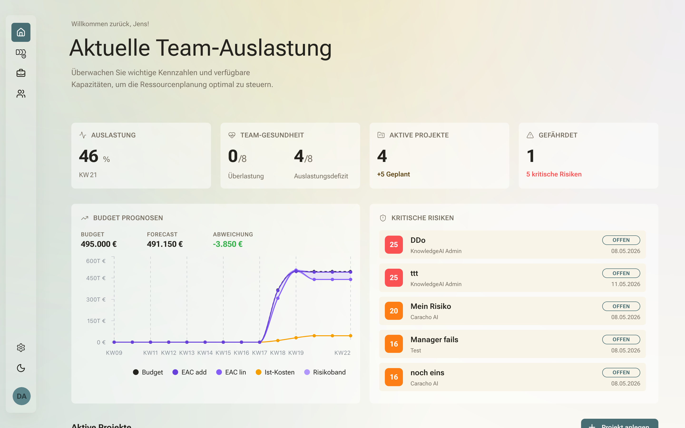
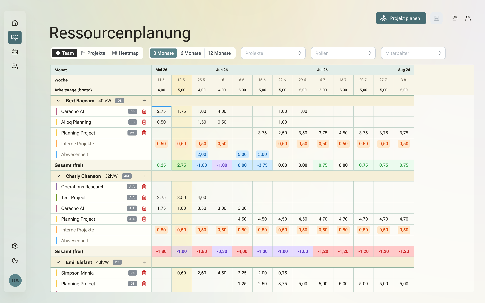
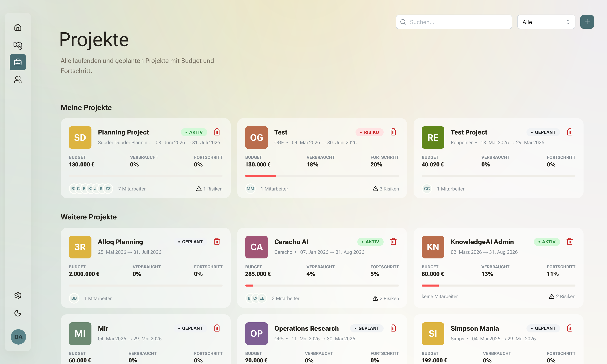
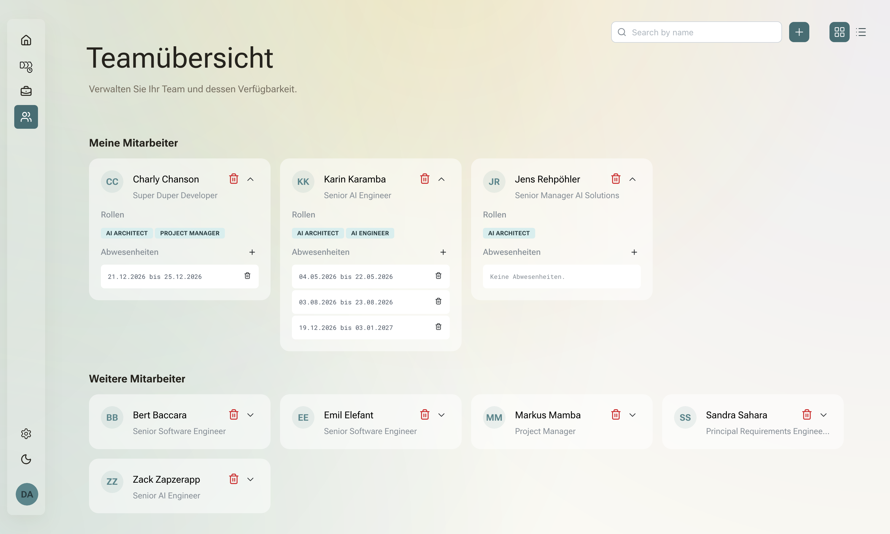
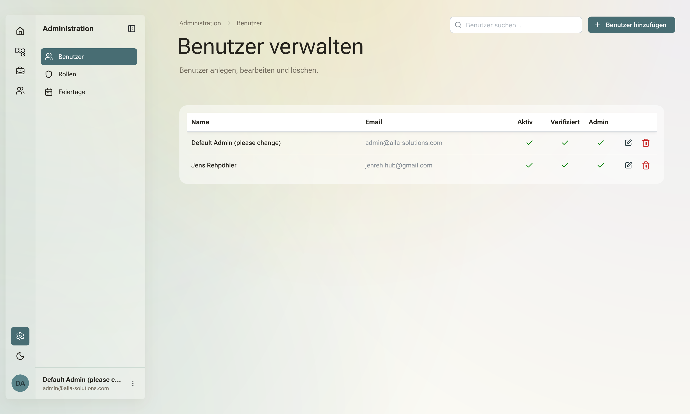

<div align="center">
  

# Alloq

  **Resource management & capacity planning for software teams**

  
  [](LICENSE.md)
  [](https://www.python.org)
  [](https://reflex.dev)

  [Features](#features) • [Getting Started](#getting-started) • [Development](#development) • [Deployment](#deployment)
</div>

---

Alloq helps software teams plan and track resource allocation across projects. Manage team capacity, forecast utilization, handle absences and public holidays — all in one place.



## Features

- **Team Overview** — Employees, roles, seniority levels, and absence tracking
- **Project Planning** — Allocate team members to projects with capacity forecasting
- **Dashboard** — Aggregated utilization metrics and team health at a glance
- **Public Holidays** — Region-aware holiday management for accurate capacity calculations
- **Authentication** — Built-in user management with OAuth support (GitHub, Azure AD)
- **Role-Based Access** — Admin and user roles with route-level protection

## Tech Stack

| Layer | Technology |
| ----- | ---------- |
| Framework | [Reflex](https://reflex.dev) 0.9.2 (full-stack Python) |
| UI Components | [appkit_mantine](https://github.com/jenreh/appkit) (Mantine 9.2) |
| Database | PostgreSQL 15 + SQLModel/SQLAlchemy 2.0 |
| Migrations | Alembic (manually authored) |
| Auth | appkit-user (session-based + OAuth) |
| Task Runner | [Task](https://taskfile.dev) |
| Package Manager | [uv](https://docs.astral.sh/uv/) |

## Getting Started

### Prerequisites

- Python 3.14+
- [uv](https://docs.astral.sh/uv/) package manager
- [Task](https://taskfile.dev) runner
- PostgreSQL 15+ (or use Docker Compose)

### Installation

```bash
# Clone the repository
git clone https://github.com/jenreh/alloq.git
cd alloq

# Initialize project (installs Python, syncs deps, sets up pre-commit, runs migrations)
task init
```

### Configuration

Copy and adjust the local config:

```bash
cp configuration/config.local.yaml configuration/config.local.yaml
```

Database connection and auth settings are configured in `configuration/config.yaml` with environment-specific overrides via profile files.

### Running

```bash
# Start the development server
task run

# Or with debug logging
task run:debug
```

The app will be available at `http://localhost:8080`.

## Development

### Project Structure

```text
app/                    # Main Reflex application (pages, styles, components)
components/
  alloq-commons/       # Shared entities, repositories, models, services
  alloq-dashboard/     # Dashboard module (aggregation, charts)
  alloq-project/       # Project planning & forecasting
  alloq-team/          # Team management views
configuration/         # YAML config files (per-environment)
alembic/               # Database migrations
tests/                 # Integration tests
```

Each `components/*` package is a uv workspace member with its own `pyproject.toml` and test suite.

### Common Tasks

```bash
task test       # Run tests with coverage
task lint       # Lint with ruff
task format     # Auto-format with ruff
task db:upgrade # Apply pending migrations
task db:revision -- "description"  # Create new migration
```

### Quality Gates

- Test coverage ≥ 80% for non-Reflex classes and State classes
- `ruff` linting and formatting (line length 88)
- Pre-commit hooks for secrets detection and formatting

## Screenshots

### Resource Planning

Weekly capacity grid with per-employee allocation, over/under-utilization highlighting, and role badges.



### Projects

Project cards with budget, progress, team members, and risk indicators.



### Team Overview

Employee cards with roles, seniority levels, and absence periods.



### Administration

User management with activation, verification, and admin role assignment.



## Deployment

### Docker

```bash
# Build and start with Docker Compose (includes PostgreSQL)
docker compose up --build
```

The Compose setup includes:

- Application container (Python 3.13 slim)
- PostgreSQL 15 with pgvector
- Dev-mode file watching with `docker compose watch`

### Environment Variables

Production secrets are referenced via `secret:` prefix in config and resolved from environment variables or a Key Vault at runtime. See `configuration/config.yaml` for the full list.

> [!NOTE]
> Never commit credentials. Use `.env` files locally and proper secret management in production.
